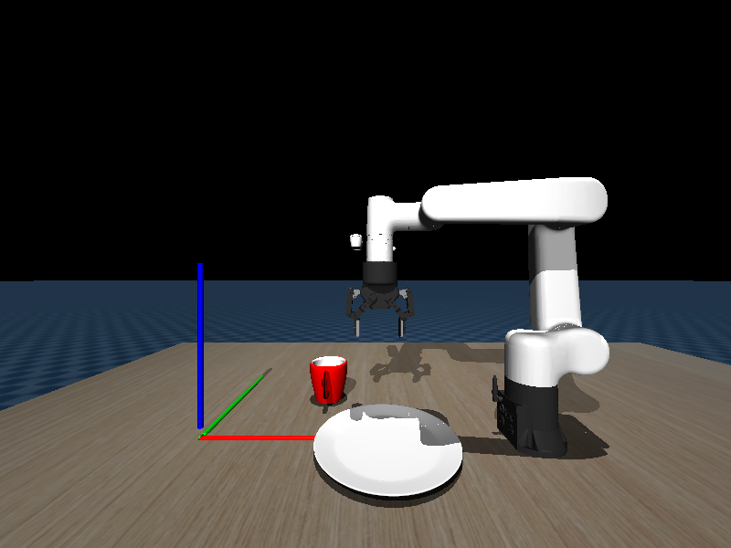
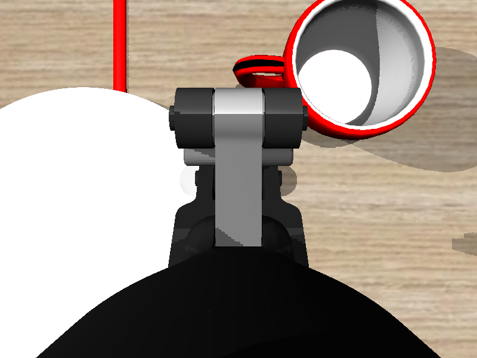
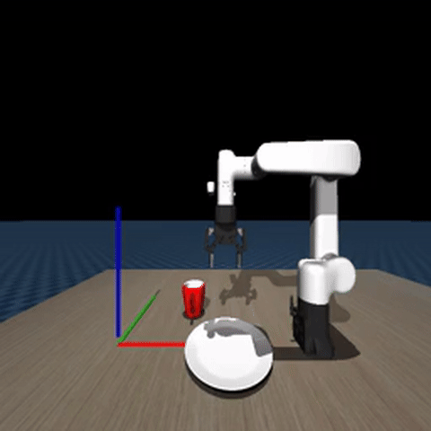

# ECO65 模仿学习：从数据采集到模型部署

<p align="center">
  
</p>

<p align="center">
  
  
  
  
  
</p>

<p align="center">
  <b>简体中文</b> | <a href="README_en.md">English</a>
</p>

---

### 项目简介

本项目实现了一个完整的机器人模仿学习流程：通过键盘遥操作系统控制 MuJoCo 仿真环境中的 ECO65 六轴机械臂，完成 **"将杯子放到盘子上"** 的拾取放置任务，采集演示数据，训练 ACT（Action Chunking with Transformers）策略网络，最终部署模型让机器人自主完成任务。

核心工作流分为四步：**数据采集 → 数据可视化 → 策略训练 → 模型部署**，基于 LeRobot 数据集框架（v3.0 格式）和 MuJoCo 物理仿真引擎构建。

### 目录

- [项目简介](#项目简介)
- [系统架构](#系统架构)
- [观测视角](#观测视角)
- [功能特性](#功能特性)
- [环境依赖](#环境依赖)
- [环境配置](#环境配置)
- [安装与构建](#安装与构建)
- [使用说明](#使用说明)
- [项目结构](#项目结构)
- [参数与配置](#参数与配置)
- [许可证](#许可证)

---

### 系统架构

```
┌─────────────────────────────────────────────────────┐
│                    数据采集 (1.collect_data.py)       │
│  键盘遥操作 → IK 求解 → MuJoCo 仿真 → LeRobot 数据集  │
│  输入: 键盘 (WASD + QE + 方向键 + Space)             │
│  输出: demo_data/ (Parquet + MP4)                    │
└──────────────────────────┬──────────────────────────┘
                           ▼
┌─────────────────────────────────────────────────────┐
│                 数据可视化 (2.visualize_data.py)      │
│  回放采集的 episode，验证数据质量                     │
│  计算归一化统计量 → stats.json                        │
└──────────────────────────┬──────────────────────────┘
                           ▼
┌─────────────────────────────────────────────────────┐
│                    训练 (3.train.py)                  │
│  ACT 策略: ResNet18 + Transformer Encoder-Decoder    │
│  输入: RGB 图像 (256×256) + 末端位姿 (6维)           │
│  输出: 关节角 + 夹爪 (7维) × 10步 action chunk       │
│  保存: ckpt/act_y/                                   │
└──────────────────────────┬──────────────────────────┘
                           ▼
┌─────────────────────────────────────────────────────┐
│                    部署 (4.deploy.py)                 │
│  加载模型 → 推理 → MuJoCo 执行 → 自主完成任务         │
│  + Temporal Ensemble 平滑 + 成功判定                  │
└─────────────────────────────────────────────────────┘
```

**ACT 网络架构：**

```
输入                          输出
┌──────────────┐             ┌──────────────────┐
│ image (3×256)│──┐          │  action chunk    │
│   ResNet18   │  │   ┌────┐ │  [10, 7]         │
│   ─────────  │──┼──▶│    │ │  t₀..t₉: 关节角  │
│  img_feat(512)│  │  │ACT │ │  + 夹爪状态       │
└──────────────┘  │  │    │ └──────────────────┘
                  │  │Tran│
┌──────────────┐  │  │sfo─│
│ state [6]    │──┤  │rmer│
│  (x,y,z,r,p,y)│  │  │Enco│
└──────────────┘  │  │der─│
                  │  │Deco │
         ┌──────┐ │  │der │
         │ VAE  │ │  │    │
         │ (32维)│─┘  │    │
         └──────┘    └────┘
```

### 观测视角

<p align="center">
  
  
</p>
<p align="center">
  <b>Agent View</b>（第三人称全局视角）&emsp;&emsp;&emsp;&emsp;&emsp;&emsp;<b>Wrist View</b>（腕部相机近距视角）
</p>

| 视角 | 来源相机 | 作用 |
|------|---------|------|
| Agent View | MuJoCo `agentview` | 全局场景感知，观察物体位置和机械臂状态 |
| Wrist View | MuJoCo `d435i_rgb` | 末端近距离视角，精确判断夹爪与物体相对关系 |

### 功能特性

- **端到端模仿学习流水线**：从数据采集到模型部署，四个脚本一站式完成
- **键盘遥操作控制**：直观的 WASD + QE 末端增量控制，无需专业遥操作设备
- **ACT 策略网络**：基于 Transformer 的 Action Chunking，预测 10 步连续动作序列，产生平滑轨迹
- **VAE 动作编码**：可选的变分自编码器，学习动作潜在表示，增强策略多样性
- **Temporal Ensemble**：部署时的时间集成平滑，消除预测抖动
- **LeRobot v3.0 数据格式**：标准化的 Parquet + MP4 存储，兼容 HuggingFace LeRobot 生态
- **MuJoCo 高保真仿真**：ECO65 六轴机械臂 + Robotiq 2F-85 夹爪 + D435i 深度相机
- **IK 逆运动学求解**：阻尼最小二乘法（DLS），支持末端空间遥操作
- **双视角渲染**：第三人称视角 (agentview) + 腕部视角 (d435i_rgb)
- **随机物体位置**：每次 reset 在桌面范围内随机生成杯子和盘子的位置，增强数据多样性

### 环境依赖

| 依赖 | 版本要求 | 用途 |
|------|---------|------|
| Python | ≥ 3.10 | 主编程语言 |
| PyTorch | ≥ 2.0 | 深度学习框架 |
| MuJoCo | ≥ 3.2 | 物理仿真引擎 |
| LeRobot | ≥ 0.4 | 数据集管理与策略框架 |
| NumPy | ≥ 1.24 | 数值计算 |
| OpenCV (cv2) | ≥ 4.8 | 图像处理 |
| Pillow | ≥ 10.0 | 图像 I/O |
| GLFW | - | MuJoCo 窗口渲染后端 |
| Matplotlib | ≥ 3.7 | 训练曲线与数据可视化 |
| TorchVision | ≥ 0.15 | ResNet 预训练权重 |

### 环境配置

推荐使用 Conda 创建独立环境：

```bash
# 创建并激活环境
conda create -n eco65_act python=3.10 -y
conda activate eco65_act

# 安装 PyTorch (根据 CUDA 版本选择)
# CUDA 12.1
pip install torch torchvision --index-url https://pytorch.org/whl/cu121
# 或 CPU only
pip install torch torchvision --index-url https://pytorch.org/whl/cpu

# 安装 MuJoCo
pip install mujoco

# 安装 LeRobot
pip install lerobot

# 安装其他依赖
pip install numpy opencv-python pillow glfw matplotlib
```

### 安装与构建

```bash
# 克隆仓库
git clone https://github.com/yakousansan/eco65-act-pnp.git
cd eco65-act-pnp

pip install -e .
```

### 使用说明

#### 第 1 步：遥操作采集数据

```bash
python 1.collect_data.py
```

在弹出的 MuJoCo 窗口中，使用键盘遥操作控制机械臂完成"将杯子放到盘子上"的任务：

| 按键 | 动作 | 说明 |
|------|------|------|
| `W` / `S` | 前进 / 后退 | 世界 X 轴，步长 0.007m |
| `A` / `D` | 左移 / 右移 | 世界 Y 轴，步长 0.007m |
| `R` / `F` | 上升 / 下降 | 世界 Z 轴，步长 0.007m |
| `Q` / `E` | 左倾 / 右倾 | 绕 Z 轴旋转 (roll) |
| `↑` / `↓` | 俯仰 | 绕 X 轴旋转 (pitch) |
| `←` / `→` | 偏航 | 绕 Y 轴旋转 (yaw) |
| `Space` | 夹爪开合 | 0 ↔ 1 切换 |
| `Z` | 重置 | 丢弃当前 episode，重新开始 |
| `Esc` | 退出 | 关闭窗口，自动保存数据 |

每完成一次成功放置，自动保存一个 episode。关闭窗口后自动编码视频并写入磁盘。

<p align="center">
  
  
</p>

> **提示**：可在脚本中修改 `NUM_DEMO` 变量调整采集条数，修改 `ROOT` 变量调整数据保存路径。

#### 第 2 步：可视化验证数据

```bash
python 2.visualize_data.py
```

在 MuJoCo 窗口中回放采集的数据，验证动作是否平滑、物体位置是否正确。同时自动计算数据统计量（均值/标准差）并保存到 `demo_data/meta/stats.json`。

<p align="center">
  
</p>

#### 第 3 步：训练 ACT 策略

```bash
python 3.train.py
```

训练过程：
- 加载数据集和统计量
- 初始化 ACT 网络（ResNet18 + Transformer + VAE）
- 3000 步训练，Adam 优化器 (lr=1e-4)，batch size=64
- 数据增强：图像高斯噪声 (std=0.02)
- 损失函数：L1 重建损失 + KL 散度 (权重 10.0)
- GPU 训练约 5-15 分钟
- 模型保存至 `ckpt/act_y/`

训练结束后自动绘制预测/真值对比图。

#### 第 4 步：部署测试

```bash
python 4.deploy.py
```

加载训练好的模型，在 MuJoCo 中自主运行。策略根据实时视觉和状态输入预测 action chunk，执行推理。成功完成任务后自动 reset 并继续。

<p align="center">
  
</p>

> 以上演示基于 10 条遥操作轨迹训练。

### 项目结构

```
eco65-act-pnp/
├── 1.collect_data.py         # 数据采集脚本（键盘遥操作 + LeRobot 录制）
├── 2.visualize_data.py       # 数据可视化脚本（回放 + 统计量计算）
├── 3.train.py                # ACT 策略训练脚本
├── 4.deploy.py               # 模型部署与推理脚本
├── model/                    # MuJoCo 模型资源
│   ├── demo_scene.xml        # 主场景（桌面 + 机器人 + 物体）
│   ├── eco65_with_2f85_d435i.xml  # ECO65 + Robotiq 2F-85 + D435i 模型
│   ├── mug_5/                # 杯子网格模型
│   ├── plate_11/             # 盘子网格模型
│   ├── tabletop/             # 桌面网格模型
│   ├── realsense_d435i/      # D435i 相机模型
│   ├── robotiq_2f85/         # Robotiq 2F-85 夹爪模型
│   └── eco65_meshes/         # ECO65 机械臂网格
├── mujoco_env/               # MuJoCo 环境封装
│   ├── __init__.py
│   ├── y_env.py              # SimpleEnv 主环境（遥操作、IK、渲染）
│   ├── mujoco_parser.py      # MuJoCo 底层接口封装
│   ├── ik.py                 # 逆运动学求解器（DLS）
│   ├── transforms.py         # 坐标变换工具（RPY ↔ 旋转矩阵等）
│   └── utils.py              # 工具函数（采样、图像、渲染）
├── ckpt/
│   └── act_y/                # ACT 策略检查点
│       └── config.json       # 策略配置（模型权重需通过训练生成）
└── demo_data/                # LeRobot 数据集（运行后生成）
    └── meta/
        └── info.json         # 数据集元信息
```

### 参数与配置

#### 数据采集参数 (`1.collect_data.py`)

| 参数 | 默认值 | 说明 |
|------|--------|------|
| `NUM_DEMO` | `1` | 采集的 episode 数量 |
| `ROOT` | `"./demo_data"` | 数据集保存路径 |
| `TASK_NAME` | `"Put mug cup on the plate"` | 任务描述文本 |
| 采集帧率 | 20 Hz | 每秒采集 20 帧 |
| 图像分辨率 | 256 × 256 | 采集图像尺寸 |

#### ACT 策略参数 (`3.train.py` 和 `ckpt/act_y/config.json`)

| 参数 | 值 | 说明 |
|------|-----|------|
| `chunk_size` | 10 | 每次预测 10 步动作 |
| `n_action_steps` | 10 (训练) / 1 (部署) | 执行步数 |
| `n_obs_steps` | 1 | 观测历史步数 |
| `dim_model` | 512 | Transformer 隐藏维度 |
| `n_heads` | 8 | 多头注意力头数 |
| `n_encoder_layers` | 4 | 编码器层数 |
| `n_decoder_layers` | 1 | 解码器层数 |
| `dim_feedforward` | 3200 | 前馈网络中间维度 |
| `dropout` | 0.1 | Dropout 比率 |
| `kl_weight` | 10.0 | VAE KL 散度权重 |
| `latent_dim` | 32 | VAE 潜在空间维度 |
| `vision_backbone` | resnet18 | 视觉骨干网络 |
| `learning_rate` | 1e-4 | Adam 学习率 |
| `training_steps` | 3000 | 训练步数 |
| `batch_size` | 64 | 批次大小 |
| `temporal_ensemble_coeff` | 0.9 (仅部署) | 时间集成平滑系数 |

#### 遥操作参数 (`mujoco_env/y_env.py`)

| 参数 | 值 | 说明 |
|------|-----|------|
| 移动步长 | 0.007 m | 键盘每次按键的末端平移量 |
| 旋转步长 | ~1.7° | 键盘每次按键的末端旋转量 |
| IK 最大迭代 | 50 | 逆运动学求解最大迭代次数 |
| IK 容差 | 1e-2 m / 5° | 位置/姿态收敛阈值 |

### 许可证

本项目基于 MIT 许可证开源。详见 [LICENSE](LICENSE) 文件。
